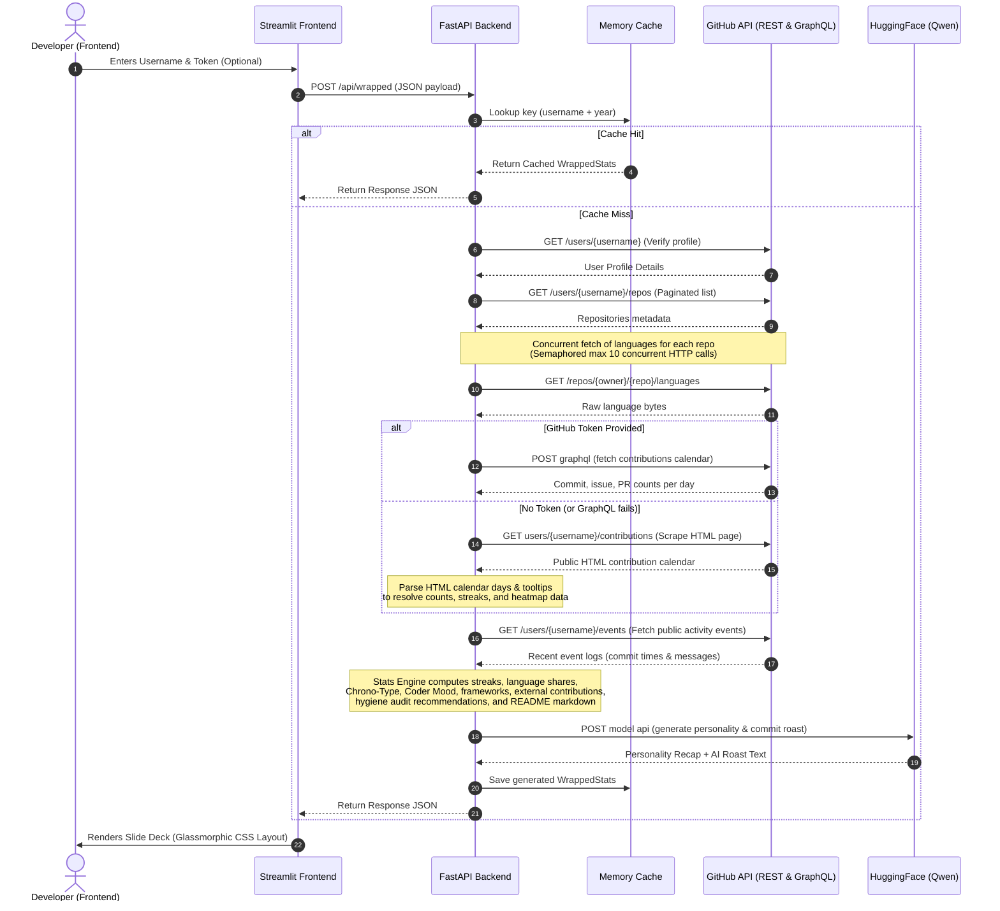

# GitHub Wrapped Developer Architecture & System Design Guide

Welcome to the internal system architecture and design documentation for **GitHub Wrapped**. This document serves as a developer-oriented guide detailing how the backend (FastAPI) and frontend (Streamlit) components interact, compute metrics, handle concurrency, and guarantee robust security.

---

## 1. System Design & File Layout Map

The project is strictly split into standard backend and frontend workspaces to maintain separation of concerns. Below is the directory tree of the key modules and their responsibilities:

```
Wrapped/
├── backend/                       # FastAPI Web Backend
│   ├── app/
│   │   ├── core/
│   │   │   ├── cache.py           # In-memory LRU caching layer for wrapped stats
│   │   │   ├── config.py          # Configuration schema validation (pydantic-settings)
│   │   │   └── security.py        # API rate-limiter setup (SlowAPI)
│   │   ├── models/
│   │   │   └── schemas.py         # schemas (Pydantic models with recommendations, external contributions, top frameworks, and Markdown card)
│   │   ├── routers/
│   │   │   └── wrapped.py         # API routing: endpoints (/api/wrapped, /image, /personality)
│   │   ├── services/
│   │   │   ├── ai_service.py      # Personality engine (HuggingFace / Qwen LLM interface)
│   │   │   ├── github_service.py  # REST and GraphQL client integrations with GitHub
│   │   │   ├── image_service.py   # Pillow canvas renderer for generating Wrapped PNG cards
│   │   │   └── stats_engine.py    # Metric aggregation, streaks, chrono-types, moods, frameworks mapper, and hygiene audit recommendations
│   │   └── main.py                # FastAPI entry point, CORS, HTTP header middleware
│   └── tests/
│       ├── test_ai_service.py     # Unit tests for HuggingFace fallback parser logic
│       ├── test_api_endpoints.py  # Router integration tests (headers, param validations, limits)
│       └── test_stats_engine.py   # Complete statistical calculation checks
│
├── frontend/                      # Streamlit Glassmorphism Web App
│   ├── components/
│   │   ├── charts.py              # Visualizing language distribution & contribution patterns
│   │   └── slides.py              # Individual wrapped carousel/slide configurations
│   └── streamlit_app.py           # Streamlit orchestrator, CSS styles injector, layout builder
│
└── docker-compose.yml             # Single-command local orchestration template
```

### Key Modules Links
* **Entry Point:** [main.py](file:///c:/Users/csoum/OneDrive/Desktop/Wrapped/backend/app/main.py)
* **API Routers:** [wrapped.py](file:///c:/Users/csoum/OneDrive/Desktop/Wrapped/backend/app/routers/wrapped.py)
* **Data Processor:** [stats_engine.py](file:///c:/Users/csoum/OneDrive/Desktop/Wrapped/backend/app/services/stats_engine.py)
* **GitHub API Client:** [github_service.py](file:///c:/Users/csoum/OneDrive/Desktop/Wrapped/backend/app/services/github_service.py)
* **Config Manager:** [config.py](file:///c:/Users/csoum/OneDrive/Desktop/Wrapped/backend/app/core/config.py)
* **Streamlit Orchestration:** [streamlit_app.py](file:///c:/Users/csoum/OneDrive/Desktop/Wrapped/frontend/streamlit_app.py)

---

## 2. Stats & Streaks Engine Math Logic

The [stats_engine.py](file:///c:/Users/csoum/OneDrive/Desktop/Wrapped/backend/app/services/stats_engine.py) file converts raw data from GitHub APIs into aggregated stats. It relies on standard computational logic to ensure absolute accuracy of stats:

### A. Contribution Streaks (`compute_streaks`)
To compute streaks, we process a flat chronological list of days:
$$\text{Day } d \in D \quad \text{where} \quad d.\text{count} \ge 0$$
1. **Longest Streak:** We iterate forward through sorted days. If $d.\text{count} > 0$, we increment the active run. If it drops to $0$, the current run resets. The longest streak tracks the historic maximum of active runs:
   $$\text{longest} = \max(\text{longest}, \text{active\_run})$$
2. **Current Streak:** To represent the user's active streak at the moment of calculation, we iterate backwards from the latest record. If $d.\text{count} > 0$, we increment the current streak. We break the iteration at the first idle day ($d.\text{count} = 0$).

### B. Language Breakdown and Weightings (`compute_language_breakdown`)
GitHub provides language usage in bytes per repository.
1. The engine aggregates total bytes across all non-fork repositories:
   $$\text{Total Bytes} = \sum_{l \in L} \text{bytes}_l$$
2. A sorting filter groups the top $N$ (default 5) languages and assigns relative percentage shares:
   $$\text{Percentage}_l = \text{round}\left( \frac{\text{bytes}_l}{\text{Total Bytes}} \times 100, 1 \right)$$
3. Any additional languages beyond $N$ are consolidated under a single `"Other"` slice to preserve layout integrity.

### C. Temporal Busy Periods (`compute_busiest_day` / `compute_busiest_month`)
The engine groups contribution totals by day of the week and calendar month:
$$\text{Busiest Day} = \operatorname*{arg\,max}_{w \in \text{Weekdays}} \sum_{d \in D_w} d.\text{count}$$
This provides a representative metric showing when the developer is most productive.

### D. Daily Chrono-Types (`determine_chrono_type`)
Commit hourly timestamps are aggregated across 24 hourly bins:
$$\text{HourlyBins}_h \quad \text{where} \quad h \in [0, 23]$$
The bins are grouped into four major daily rhythm categories:
- **Midnight Gremlin 😈:** $h \in [0, 5]$
- **Early Bird 🌅:** $h \in [6, 11]$
- **Afternoon Architect 🏗️:** $h \in [12, 17]$
- **Night Owl 🦉:** $h \in [18, 23]$

The developer's chrono-type is determined by taking the argmax of the summed categories:
$$\text{ChronoType} = \operatorname*{arg\,max}_{c \in C} \sum_{h \in \text{Range}_c} \text{HourlyBins}_h$$

### E. Coder Mood Sentiment Matrix (`calculate_coder_mood`)
Recent commit message texts are evaluated against a weighted keyword scanner:
- **Zen Coder 🧘 (Weight 1.0):** Standard prefixes like `feat`, `docs`, `refactor`, `clean`.
- **Chaotic Hacker ⚡ (Weight 1.0 / 2.0):** Standard placeholders like `wip`, `update`, `test`, or ALL CAPS screams.
- **Frustrated Solver 🤯 (Weight 1.5):** Debug expressions like `fix`, `error`, `bug`, `wtf`, `crying`.
- **Exhausted Warrior 😴 (Weight 1.0):** Exhaustion indicators like `tired`, `sleep`, `finally`, `sigh`.

The category with the highest weighted count is assigned as the dominant vibe of the repository history.

### F. Tech Stack Frameworks Analyzer (`analyze_frameworks_and_tools`)
Scans repository topics and descriptions for case-insensitive matches against keywords of popular frameworks (React, Vue, FastAPI, Django, Flask, PyTorch, Docker, Kubernetes, Terraform) and yields the top 5 most common framework keys.

### G. Habits & Hygiene Audit (`audit_habits_and_hygiene`)
Evaluates owned repositories for presence of licensing metadata, engaging descriptions, and branch conventions (PRs vs commits) to construct up to 3 growth recommendations.

### H. Open-Source Impact Tracker (`calculate_external_contributions`)
Tallies public events where the repository owner username does not match the request username to calculate community contributions count.

### I. Markdown Profile README Card (`generate_markdown_readme`)
Generates a pre-formatted Markdown code snippet containing a card layout summarizing total commits, stars, top frameworks, and chrono-type to share in profile READMEs.

---

## 3. Lifecycle Flow of a Wrapped Request

When a user submits their username on the frontend, the application moves through the following request-response lifecycle:



---

## 4. Backend Security Configurations List

To mitigate vulnerability vectors, the backend implements the following security mechanisms:

| Security Vector | Implementation Detail | Location |
| :--- | :--- | :--- |
| **Exposure of Credentials** | `github_token` is parsed only via POST requests inside the request body. Query strings (GET) are never used for token transfer, keeping authentication keys out of proxy server logs. | [wrapped.py](file:///c:/Users/csoum/OneDrive/Desktop/Wrapped/backend/app/routers/wrapped.py) |
| **Input Validation & Sanitization** | `github_token` values are vetted by a Pydantic string format validator (`pattern="^(gh[pousr]_[A-Za-z0-9_]{36,251}|github_pat_[A-Za-z0-9_]{82,255})$"`). Non-matching patterns are rejected instantly before API execution. | [schemas.py](file:///c:/Users/csoum/OneDrive/Desktop/Wrapped/backend/app/models/schemas.py) |
| **Injection Mitigation** | Path parameter username tags are strictly restricted to alphanumeric identifiers and dashes using FastAPI regex route filters (`pattern="^[a-zA-Z0-9-]{1,39}$"`), preventing path traversal attacks. | [wrapped.py](file:///c:/Users/csoum/OneDrive/Desktop/Wrapped/backend/app/routers/wrapped.py) |
| **Branding Control & Leakages** | In production mode, the endpoints `/docs` and `/redoc` are disabled to conceal the internal schema definitions and API capabilities from scanner probes. | [main.py](file:///c:/Users/csoum/OneDrive/Desktop/Wrapped/backend/app/main.py) |
| **Browser Integrity** | Injects strict security response headers: `X-Frame-Options: DENY`, `X-Content-Type-Options: nosniff`, `X-XSS-Protection: 1; mode=block`, and `Referrer-Policy: no-referrer`. | [main.py](file:///c:/Users/csoum/OneDrive/Desktop/Wrapped/backend/app/main.py) |
| **Concurrency Safeguard** | An `asyncio.Semaphore(10)` rate-limits the concurrent queries sent to GitHub language API to prevent the server from triggering secondary rate limit blockades on users with extensive repo portfolios. | [github_service.py](file:///c:/Users/csoum/OneDrive/Desktop/Wrapped/backend/app/services/github_service.py) |
